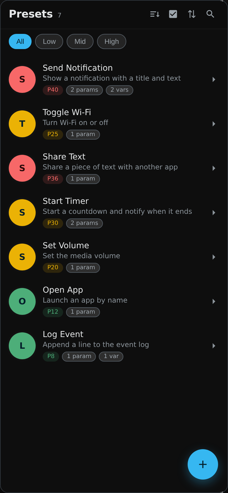
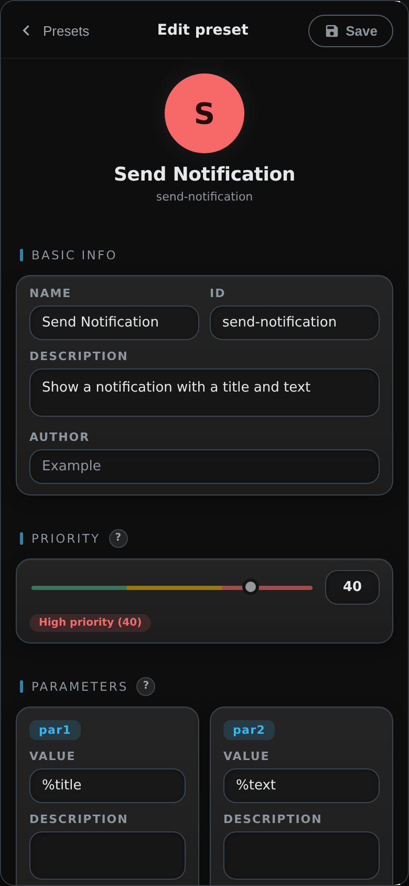
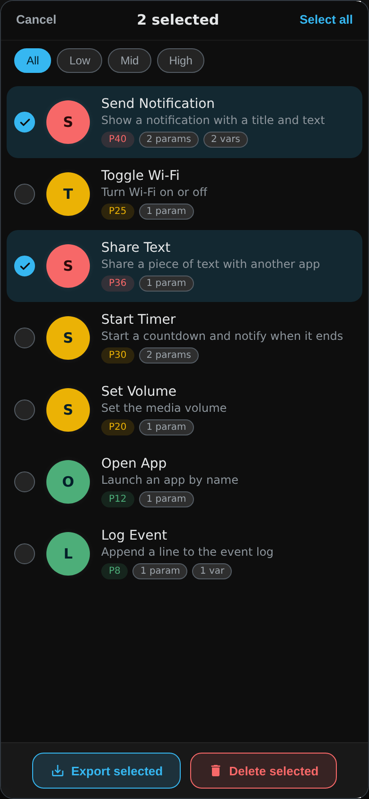
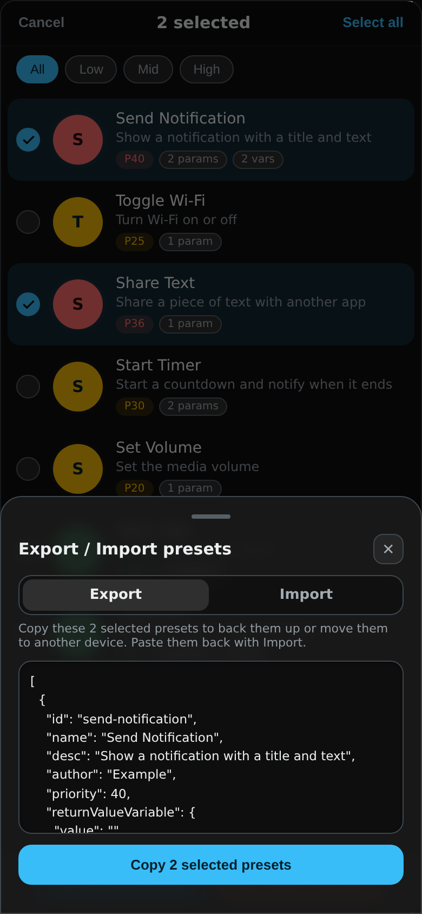

# Preset Tasks

Build, organize and share reusable **task presets** for Tasker.

<table>
  <tr>
    <td></td>
    <td></td>
    <td></td>
    <td></td>
  </tr>
</table>

*Sample presets shown.*

## What is a preset?

A preset describes a Tasker task you want to reuse: what it's called, what it does, how important it is, and what it needs (parameters and variables) and returns. Your presets are stored in the Tasker global variable `%PresetTasks` as JSON, so your own tasks, or other projects, can read them.

## Documentation

- [Setup](docs/setup.md): installing and updating
- [User guide](docs/user_guide.md): using every part of the screen
- [FAQ](docs/faq.md): common questions

## Features

- **Fast and searchable** – search by name, ID or author; filter by priority (Low / Mid / High); sort your own way
- **Complete presets** – name, ID, description, author, priority (1–50), two parameters, any number of pass variables, and a return value variable
- **Bulk actions** – select several presets to export or delete them in one go (deleting can be undone)
- **Backup and sharing** – export every preset, or only the ones you select, as JSON; import one preset or a whole list, adding to or replacing what you have
- **Safe editing** – you're asked before unsaved changes are thrown away; duplicate a preset to start from an existing one
- **Gestures** – swipe a preset to open it; swipe in from the left edge to go back

## Privacy

Presets stay on your device, in Tasker. Nothing is collected or sent anywhere.

## Contributing

[Open an issue](../../../issues) for bugs or ideas.
